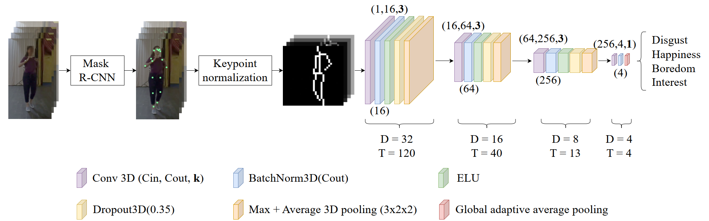

# Markerless Emotion Recognition from Full-Body Movements for Social XR (SPIC 2026)



Official repository of the article "Markerless emotion recognition from full-body movements for Social XR", published in Signal Processing: Image Communication.

The approach classifies four emotions (interest, happiness, boredom, disgust) from body language alone. Skeleton joints are extracted from consumer-camera videos with Keypoint R-CNN, normalised into a depth-independent representation, rendered as 32x32 binary skeleton images, and classified by a lightweight 3D CNN. Faces are blurred before keypoint extraction, and the released data contains joint coordinates only.

# Instructions

The structure of the project is the following:

- 📁 data
    - 🔢 keypoints_blurred.npz (joints extracted from the face-blurred videos)
    - 🔢 keypoints.npz (joints extracted from the original videos)
    - 🔢 HEROES_dataset.xlsx (clip names, camera flags, actor and clip identifiers)
- 📁 figures
- 📁 tests
    - 📄 test_splits.py (checks that no actor or performance leaks across folds)
- 📄 environment.yml (Conda environment to import)
- 📄 build_dataset.py (rasterises the keypoints into skeleton images)
- 📄 data.py (metadata, cross-validation folds, data modules)
- 📄 models.py 
- 📄 train.py (5-fold training, validation, and testing)
- 📄 summarize_results.py (results table and confusion matrices)
- 📄 extract_keypoints.py (face blurring and Keypoint R-CNN, for new recordings)
- 📄 predict.py (emotion prediction for new videos)

The repository is self-contained: the keypoints of all 2,677 clips are in `data/`, and everything else is generated from them.

## 1. Environment

```bash
conda env create -f environment.yml
conda activate emotion-xr
```

The environment installs the CUDA 12.1 build of PyTorch; remove the `--extra-index-url` line from `environment.yml` for a CPU-only install.

## 2. Skeleton images

```bash
python build_dataset.py
```

120 frames of 32x32 skeleton images per clip. It takes under a minute on CPU. Add `--no-blur` to use the keypoints extracted from the unblurred videos.

## 3. Training

```bash
python train.py --view frontal         # one camera: frontal, left, or right
python train.py --view independent     # all cameras pooled, view-agnostic
python train.py --view fusion          # late fusion of the three views

python summarize_results.py --plot     # results table and confusion matrices
```

Each command runs a 5-fold cross-validation. For test fold *k*, fold *k*+1 selects the checkpoint (validation) and the other three train it; the test fold is evaluated once. A fold takes 5 to 20 minutes on an RTX 4070, depending on the configuration. Per-fold metrics are written to `results/<configuration>.json` and the best model of every fold to `checkpoints/<configuration>/fold<k>.ckpt`.

Two cross-validation splits are available through `--split`:

- `actor` (default): five folds of three actors. No actor is seen during both training and test, which is the situation of a deployed system meeting new users.
- `clip`: the per-clip folds stored in `HEROES_dataset.xlsx`. Actors appear in every fold, but the three views of a performance always share one, so a performance is never trained on from one camera and tested from another.

`python tests/test_splits.py` verifies these properties.

## 4. Inference on new videos

```bash
python predict.py my_video.mp4
python predict.py frontal.mp4 --left left.mp4 --right right.mp4
```

```
Prediction: Interest (5 models)
  Interest    65.6%
  Boredom     26.6%
  Disgust      6.1%
  Happiness    1.8%
```

`predict.py` runs the full pipeline on a video showing one person's whole body: face blurring, keypoint extraction, skeleton normalisation, and classification with the five cross-validation models trained in step 3, whose probabilities are averaged. It uses the frontal models by default, and the late-fusion models when the left and right views are given. The first 20 frames are skipped and the next 120 (4 s at 30 fps) are analysed.

Keypoint R-CNN weights (226 MB) are downloaded by torchvision on first use. Keypoint extraction takes a few seconds per clip on a GPU and about two minutes on CPU; the classifier itself is near-instantaneous.

## Data

The data comes from the HEROES database: 15 non-professional actors performing four emotions in two scenarios, observational (A) and interaction with another person (B), filmed simultaneously by a frontal, a left, and a right camera, for 2,677 clips in total.

Raw videos are not shared, for privacy reasons. `data/keypoints_blurred.npz` holds, for every clip, the 17 COCO joints (x, y, visibility) of the most confident person in each of the 120 analysed frames, plus a `valid` mask marking frames with no detection. The faces were blurred before extraction; `keypoints.npz` holds the same joints extracted from the unblurred videos. Rows follow `HEROES_dataset.xlsx`, whose clip names read `<actor>_<camera>_<emotion>_<clip>_<scenario>.mp4`, with camera in F/L/R and emotion in I/H/B/D.

To process new recordings, `extract_keypoints.py` reproduces the extraction from the proposed method. Face blurring with a Haar cascade, then Keypoint R-CNN (ResNet-50 FPN, COCO weights).

> ### ℹ️ The results with this repository will not be exactly the same as the published manuscript
> This repository follows a different split than the one published (disjoint author splits rather 
> than per-clip). It is expected a decrease of performance (from 5 to 10%), but still holding the
> main points of the published article. 


## Authors

Michael Neri*, Sara Baldoni°, Marco Carli^, Federica Battisti°

*Faculty of Information Technology and Communication Sciences, Tampere University, Tampere, Finland

°Department of Information Engineering, University of Padova, Padua, Italy

^Department of Industrial, Electronic, and Mechanical Engineering, Roma Tre University, Rome, Italy

## Reference

If you use part of this code, please cite the following article

```
@ARTICLE{Neri_SPIC_2026,
  author={Neri, Michael and Baldoni, Sara and Carli, Marco and Battisti, Federica},
  journal={Signal Processing: Image Communication},
  title={{Markerless emotion recognition from full-body movements for Social XR}},
  year={2026},
  volume={143},
  pages={117489},
  doi={10.1016/j.image.2026.117489}
  }
```
